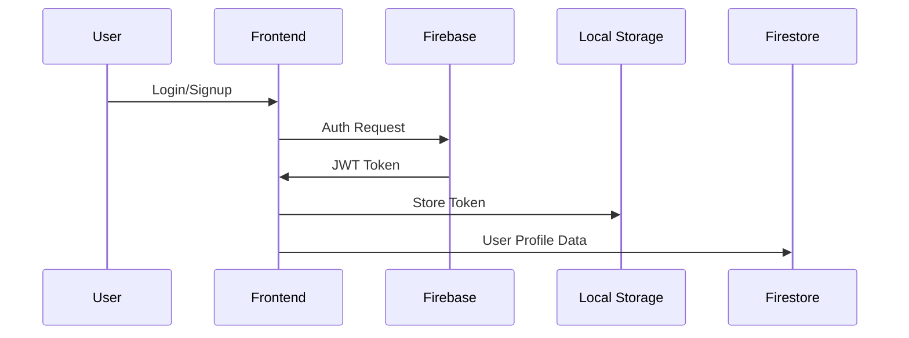
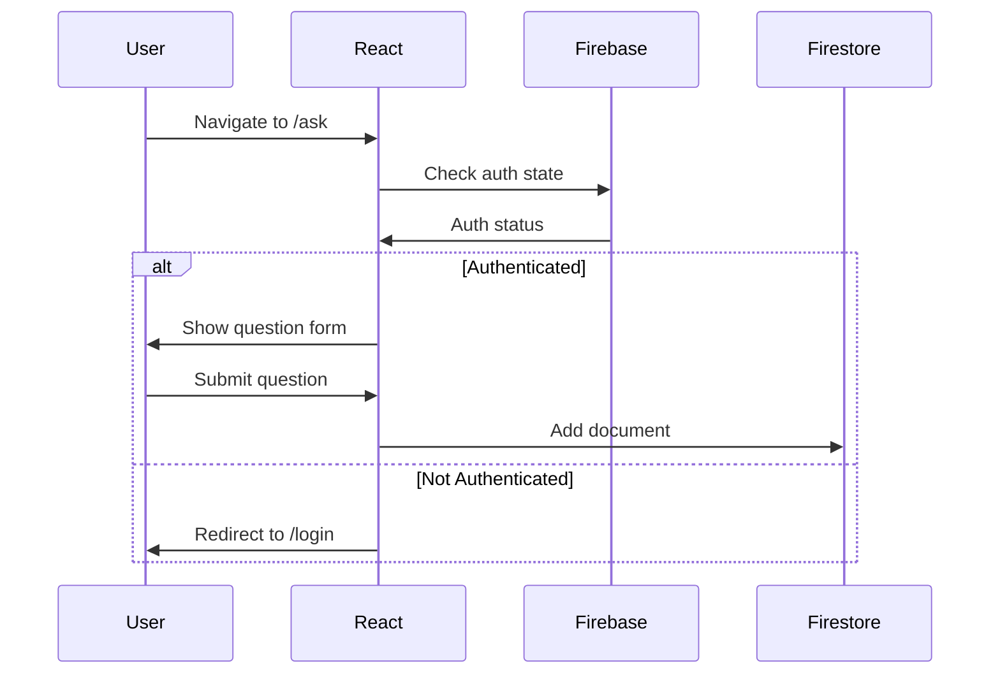

<p align="center">

</p>


<p align="center">
  <a href="https://react.dev/">
    
  </a>
  <a href="https://firebase.google.com">
    
  </a>
  <a href="https://www.typescriptlang.org/">
    
  </a>
</p>

## Overview

GoQnA is a modern, full-featured **Q&A Knowledge Sharing Platform** built with React, TypeScript, and Firebase. It enables seamless knowledge sharing through community-driven questions and answers, supporting real-time interactions, rich text formatting, and intuitive user experience.

## Features


### Core Functionality
- [x] **JWT Authentication** with Firebase Auth
- [x] Rich Text Editor (Markdown Support)
- [x] Voting System for Questions/Answers
- [x] Nested Comments with Replies
- [x] Basic Search Functionality
- [x] Tag-based Categorization
- [x] Real-time Notifications
- [x] User Reputation System
- [x] Generate AI Answer

### Advanced Features
- [x]  **Question Management**
  - Create/Edit/Delete Questions
  - Accept Best Answers
  - Track Views/Upvotes
- [x]  **Answer System**
  - Multiple Answer Support
  - Answer Validation
  - Code Snippet Formatting
- [x]  **User Profiles**
  - Activity History
  - Reputation Tracking
  - Profile Customization

### Planned Features

The platform is modular and designed to scale. Upcoming enhancements may include:

- [ ] Team-based collaboration (private/public groups)
- [ ] Advanced analytics for engagement insights
- [ ] Admin dashboards
- [ ] Role-based access control
- [ ] Integration with third-party services (e.g., GitHub, Slack)


## Technology Stack

### Frontend
| Technology | Purpose | Version |
|------------|---------|---------|
| React | UI Components | 18.3.1 |
| TypeScript | Type Safety | 5.5.3 |
| React Router | Navigation | 6.22.0 |
| Tailwind CSS | Styling | 3.4.1 |
| Firebase SDK | Realtime Database & Auth | 10.8.0 |

### Backend
| Service | Purpose |
|---------|---------|
| Firebase Firestore | NoSQL Database |
| Firebase Auth | User Authentication |
| Express.js | API Endpoints (Future) |
| Vite | Build Tool | 

> [!NOTE]
> Express.js is currently scaffolded for future backend expansion—Firebase handles most real-time and auth functionality.

### Development Tools
- ESLint + Prettier (Code Quality)
- PostCSS (CSS Processing)
- Concurrently (Parallel Scripts)
- Date-fns (Date Formatting)

## Installation

> [!IMPORTANT]
> Make sure Node.js ≥18.x and a configured Firebase project are available before setup.

### Prerequisites
- Node.js ≥18.x
- Firebase Project
- Git

### Setup Steps
1. Clone repository:
```bash
git clone https://github.com/ravikant-diwakar/GoQnA-Knowledge-Sharing-Platform.git
cd GoQnA-Knowledge-Sharing-Platform
```

2. Install dependencies:
```bash
npm install
cd src/firebase && npm install
```

3. Firebase Configuration:
```bash
# Create .env file in root directory
VITE_FIREBASE_API_KEY=your_key
VITE_FIREBASE_AUTH_DOMAIN=your_project.firebaseapp.com
VITE_FIREBASE_PROJECT_ID=your_project_id
VITE_FIREBASE_STORAGE_BUCKET=your_bucket
VITE_FIREBASE_MESSAGING_SENDER_ID=your_sender_id
VITE_FIREBASE_APP_ID=your_app_id
```

4. Start development servers:
```bash
npm run dev:all
```

> [!TIP]
> Use ```npm run dev:all```to run both frontend and backend in parallel during local development.

## Project Structure

```
├── server/               # Express API endpoints
├── src/
│   ├── components/       # Reusable UI components
│   ├── context/          # React Context providers
│   ├── firebase/         # Firebase configuration
│   ├── hooks/            # Custom React hooks
│   ├── pages/            # Route components
│   └── types/            # TypeScript definitions
├── public/               # Static assets
└── tailwind.config.js    # Tailwind configuration
```

## Key Implementation Details

### Authentication Flow


### Execution Flow
1. **User Journey**:


2. **Data Flow**:
```typescript
// Typical data fetching pattern
const { data, loading, error } = useFirestore<Question>('questions')
  .getDocuments(
    [/* query conditions */],
    'createdAt', 
    'desc', 
    20
  );
```

> [!NOTE]
> This pattern ensures real-time sync and paginated fetching for Firestore collections.

> [!CAUTION]
> This architecture provides a **scalable foundation** but requires additional security measures and error handling for production readiness. The Firebase-centric approach enables rapid development but needs careful attention to security rules and query optimization.

### Data Modeling
**Question Document**
```typescript
interface Question {
  title: string;
  body: string;
  tags: string[];
  views: number;
  upvotes: number;
  answerCount: number;
  isSolved: boolean;
  createdAt: Timestamp;
  userId: string;
}
```

### Security
> [!WARNING]
> The following Firestore rules are minimal and intended for development only.
 
> [!IMPORTANT]
> You must customize these rules before deploying to production to prevent unauthorized access.

Production deployment requires Firestore Security Rules:
```javascript
rules_version = '2';
service cloud.firestore {
  match /databases/{database}/documents {
    match /questions/{questionId} {
      allow read: if true;
      allow create: if request.auth != null;
      allow update, delete: if request.auth.uid == resource.data.userId;
    }
  }
}
```

## Contributing

We welcome contributions! Please follow these steps:
1. Fork the repository
2. Create your feature branch (`git checkout -b feature/AmazingFeature`)
3. Commit your changes (`git commit -m 'Add some AmazingFeature'`)
4. Push to the branch (`git push origin feature/AmazingFeature`)
5. Open a Pull Request

## License

Distributed under the MIT License. See [LICENSE](./LICENSE) for more information.

